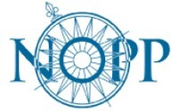

# APSViz UI/V3.

**This repository represents the third version of the APSViz user interface. This application is used to render the products of the ADCIRC Prediction System (APS).**

***
### APS - The ADCIRC Prediction System.
The ADCIRC Prediction System (APS) is a coastal hazards prediction system built around the ADCIRC coastal circulation and storm surge model.

Coastal water level, wave and inundation forecasts are provided as part of an active, community-based research program to improve and expand these capabilities. Forecasts for the US East and Gulf coasts are updated four times daily using meteorological forecasts from the Global Forecast System.

During tropical events additional water level, wave and inundation model forecasts are provided using alternative meteorological forecasts.

***
### ADCIRC - ADvanced CIRCulation.

ADCIRC is a system of computer programs for solving time dependent, free surface circulation and transport problems in two and three dimensions. These programs utilize the finite element method in space allowing the use of highly flexible, unstructured grids. Typical ADCIRC applications have included:

- Prediction of storm surge and flooding
- Modeling tides and wind driven circulation
- Larval transport studies near shore marine operations
- Dredging feasibility 
- and Material disposal studies
***

### **Top-level Technologies and component versions used in the APSViz application.**

> *Please refer to the package.json file in this repository for a complete listing of other supporting packages used in this product.*

| **Technology** | **Version** |
|:--------------:|:-----------:|
|     ESLint     |   9.11.1    |
|   JavaScript   |    >ES6     |
|      Node      |   20.17.0   |
|      NPM       |   10.8.0    |
|     React      |   18.3.1    |

### Supporting systems and tools.

| **Technology** | **Version** |
|:--------------:|:-----------:|
|     Docker     |   27.1.1    |
|    FastAPI     |   0.115.2   |
|   Geoserver    |   2.20.1    |
|   Kubernetes   |   1.29.8    | 
|   PostgreSQL   |   15-3.3    |
|    RabbitMQ    |   3.9.13    |
|     SFTPGo     |    2.2.3    |
| TDS (THREDDS)  |    5.4.0    |

***
### **Code quality and consistency.**
**This codebase is routinely examined for package version upgrades and vulnerabilities.**

***
### **Installing this project.**
#### Dockerfile command line
docker build --build-arg APP_VERSION=PROD \
--build-arg APP_GS_DATA_PROD_URL="GeoServer URL" \
--build-arg APP_UI_DATA_PROD_URL="UI Data provider URL" \
--build-arg APP_UI_DATA_PROD_TOKEN="JWT token" \
--build-arg APP_UI_HURRICANE_ICON_PROD_URL="Hurricane icon file server URL" \
--build-arg APP_PACKAGE_RENCI_REGISTRY="Custom package registry" \
--build-arg APP_PACKAGE_REGISTRY_TOKEN="Custom package registry token" \
--no-cache --progress plain -f APSViz-UI-V3\Dockerfile -t apsviz-ui-v3:latest .

#### Kubernetes
Please refer to the APSVis Helm repo [here](https://github.com/RENCI/apsviz-helm) for all Kubernetes deployment configurations.

***
### **Attributions and collaborators.**

